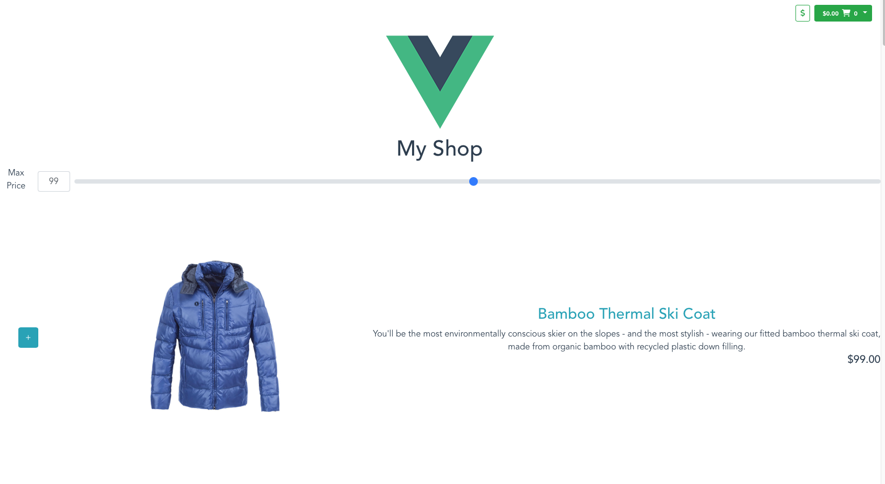

# shop-app

This was a simple shop built to learn how to make reactive components with Vuejs 3

## Project setup

```
npm install
```

### Compiles and hot-reloads for development

```
npm run serve
```

### Compiles and minifies for production

```
npm run build
```

### Lints and fixes files

```
npm run lint
```

### Customize configuration

See [Configuration Reference](https://cli.vuejs.org/config/).



### Docker

Run the project without kubernetes

```sh
# building the image, at top root folder

docker build -t shop-app .
```

```sh
# create/run the container
docker run -p 8081:8081 shop-app
```

### Kubernetes - Minkube

Use minikube locally for creating a local cluster
If you don't already have minikube install, follow this [guide](https://minikube.sigs.k8s.io/docs/start/)
You will also need [kubectl](https://kubernetes.io/docs/tasks/tools/install-kubectl-linux/)

```sh
minikube start


# To point your shell to minikube's docker-daemon, run:
# this ensures minikube has access to the local docker image
eval $(minikube -p minikube docker-env)
docker build -t shop-app .

cd kubernetes
kubectl create -f frontend.yaml

kubectl expose deployment shop-app-deployment --type=NodePort

minikube service shop-app-deployment
```
